# University of Ghana Department of Computer Science Website

## Introduction

This is the repository for the University of Ghana Department of Computer Science website. The project aims at creating a designed website for the Computer Science Department and Improving it.

## Purpose

The website comprises of the following:
- **Home Page:** Provides an overview of the Department of Computer Science.
- **About Page:** The page taks about the Department.
- **Undergraduate Courses:** Provids the current undergraduate courses at the department.
- **Graduate Course:** Provids the current Graduate courses at the department comprising of Phd, Mphil and Msc courses.
- **Short Courses:** Provides short courses on various subjects.
- **Event Announcements:** Stay updated on upcoming events, seminars, and workshops.
amongst others.
- **Location:** Provide the location and contact infomation of the Department .
- **And many more:**
## Setup Instructions

### Clone the Repository

```bash
git clone https://github.com/0555735524/DCIT_205_IA
```

### Inspection 

1. Navigate to the project directory.
2. Open "Home.html"  and run with Live Server, to view the redesigned and improved page of the department website.
3. To view the other pages, use the varios links provided on each page to navigate.

## Author
**Created By:**

- **Name: Anti Bright Gyeadu**

- **Student ID: 11340436**

## Screenshots

### Home Page


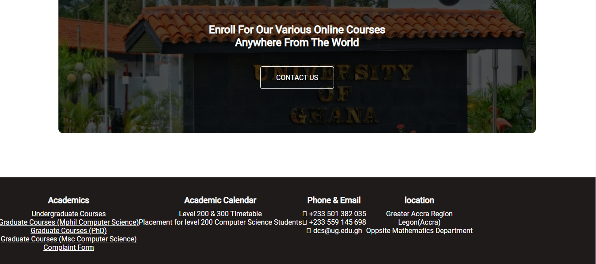


### About Page
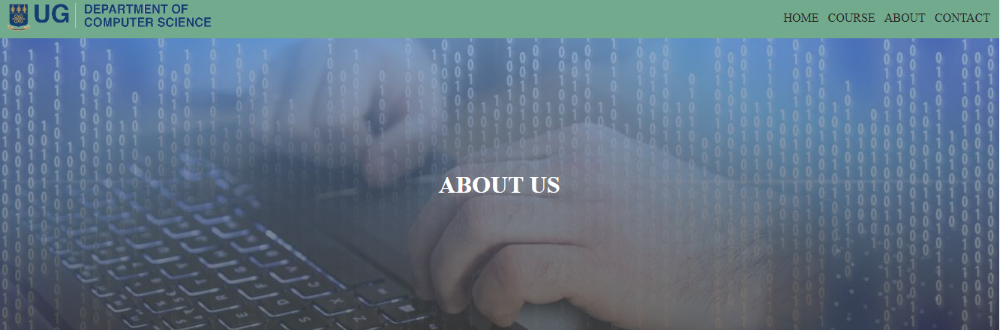
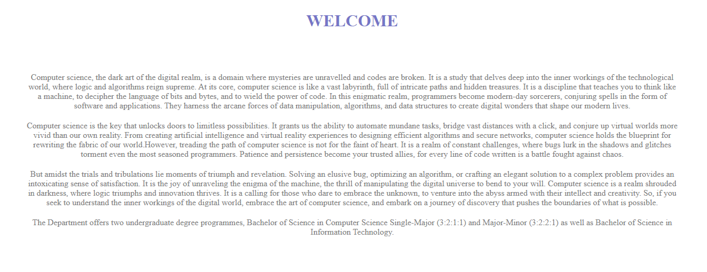

#### Complaint Form
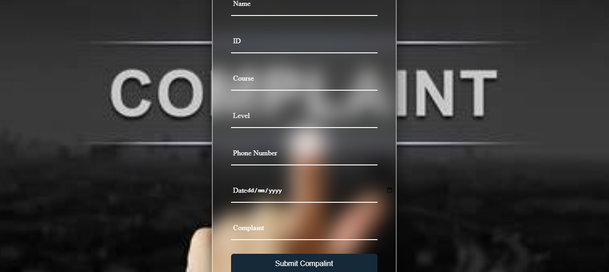

### Events Page

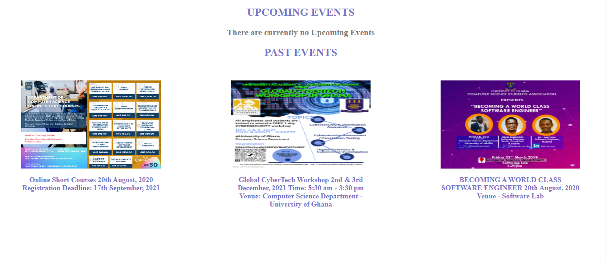

### Undergraduate Course
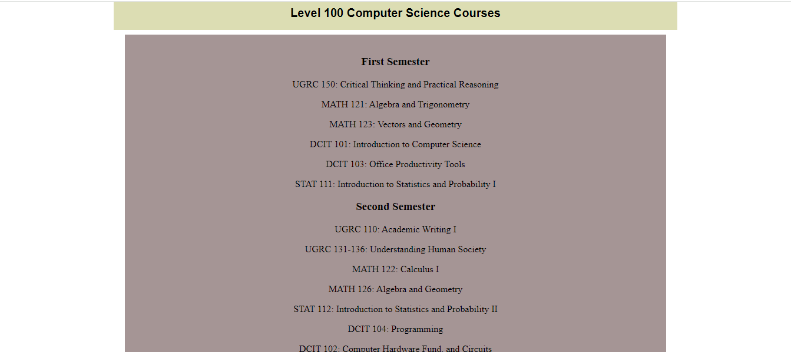
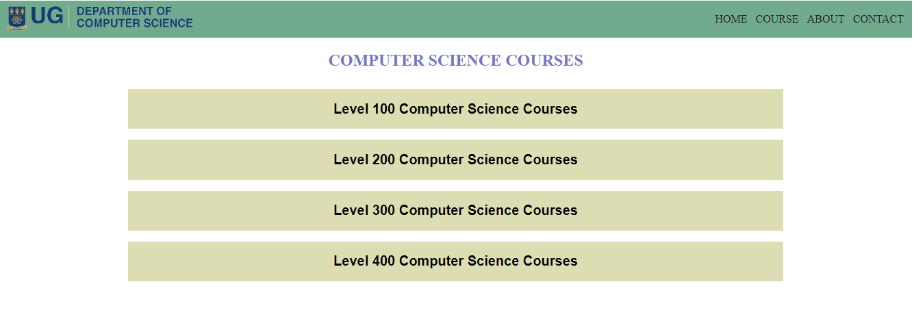

### Mphil And Msc Courses
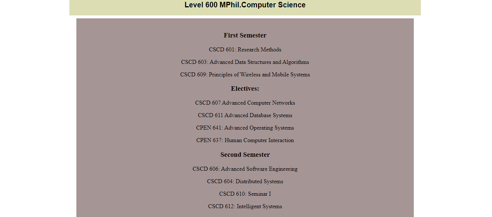
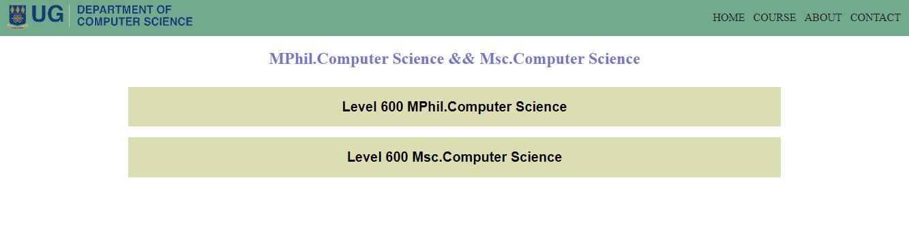


### PHD Course
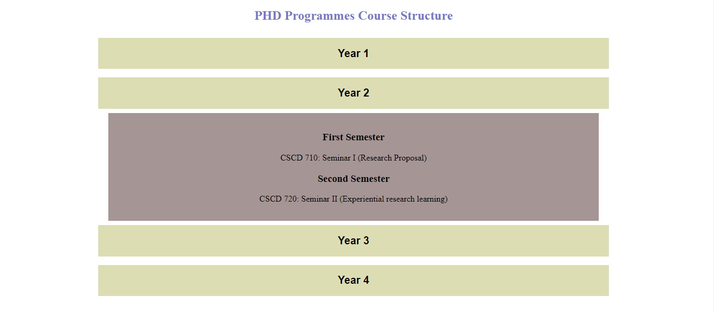


### Short Course
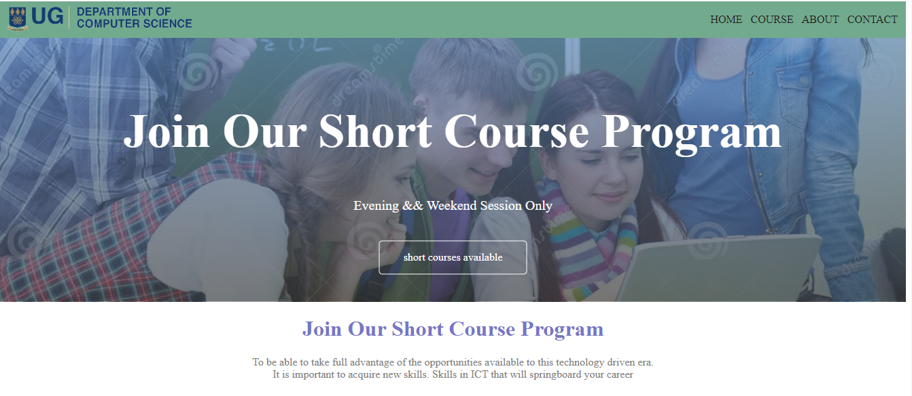


### Research Page
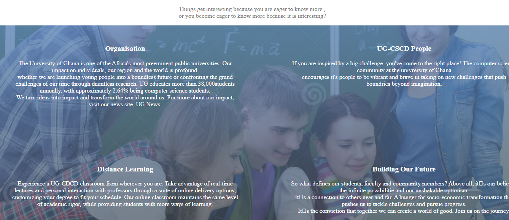

### Contact Page
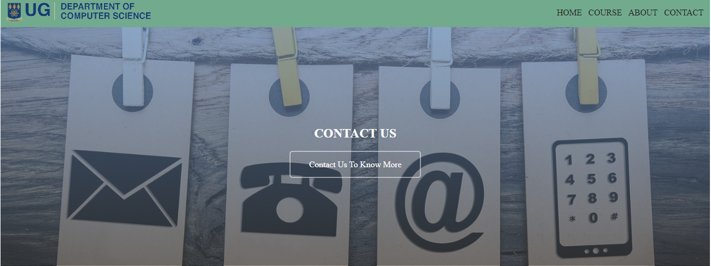
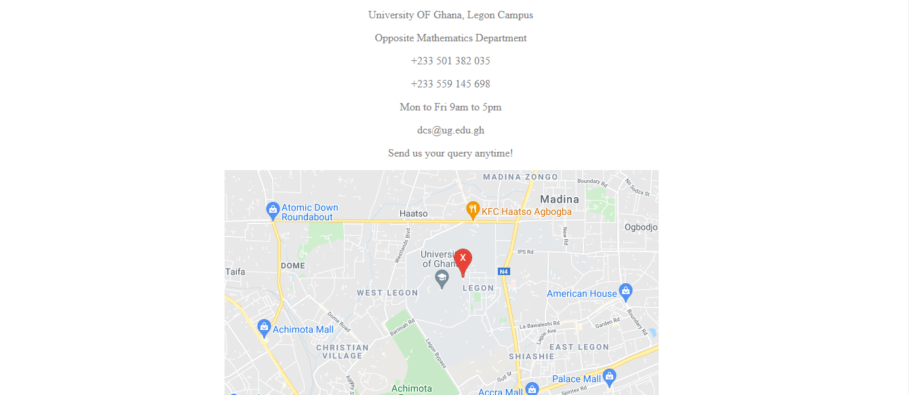


## Project Insights

Throughout this project, I gained a better understanding in the usage of:
- **Web Development:** Utilizing HTML, CSS, and JavaScript for a responsive and visually appealing interface.
- **Version Control:** Effectively using Git for collaborative development and version management.
- **Documentation:** Writing clear and concise documentation for the project.
### 
